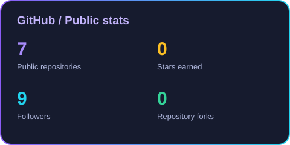
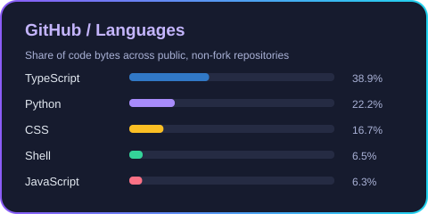

# 👋 Mattia Valerio

### I build complex systems that work.

Full stack developer with a backend focus. 
I design complex systems, build AI automations, and develop software I sell to my clients.

---

## 🧠 The work behind the product

My work starts with how a system should behave: its data, business logic, integrations, and the processes it needs to support. I build the backend, connect the frontend, and take the application through to deployment on Linux servers.

**TypeScript is the foundation of my stack.** I use NestJS for backend applications and Turborepo to organize apps and shared packages in a monorepo. For AI automation, I build with Mastra, OpenAI, Claude, and OpenRouter. Docker and Docker Compose are part of how I deliver and run these systems.

I develop products for my clients, so my focus extends beyond implementing features: the pieces need to work together as software people can actually use.

 

<table>
<tr>
<td width="33%" valign="top">

### ⚙️ Systems

Backend architecture, business logic, APIs, service integrations, and real-time data.

**TypeScript · NestJS · Node.js**

</td>
<td width="33%" valign="top">

### 🤖 Automation

AI agents and workflows that connect models, tools, and application logic.

**Mastra · OpenAI · Claude · OpenRouter**

</td>
<td width="33%" valign="top">

### 🚀 Delivery

Monorepo development and containerized applications deployed on Linux servers.

**Turborepo · Linux · Docker · Compose**

</td>
</tr>
</table>

 

## 🛠️ My stack

### Backend & data

### AI & automation

### Frontend

### Infrastructure & tooling

## 🚀 Products I build

| Product | What it does |
| --- | --- |
| [**📈 Hyper Broker**](https://www.mattiavalerio.dev/lavori/hyper-broker) | Trading account monitoring with real-time positions, performance, and activity. |
| [**🎙️ Audix**](https://www.mattiavalerio.dev/lavori/audix) | AI-powered audio transcription, translation, and subtitle generation. |
| [**🎟️ Timbry**](https://www.mattiavalerio.dev/lavori/timbry) | Digital loyalty cards with QR codes, stamps, and automatic rewards. |
| [**💸 MyFinance**](https://www.mattiavalerio.dev/lavori/myfinance) | Personal budgets, expense categories, and financial overviews. |

## 🧩 Inside my public repositories

### [MVskills ↗](https://github.com/MattiaValerio/MVskills)

**Engineering workflows for AI coding agents.** A collection of skills that brings together development practices and application profiles: from project setup to backend/frontend integration and deployment checks.

PNPM / TURBOREPO / NESTJS / REACT / KYSELY / POSTGRESQL / DOCKER COMPOSE

---

### [Hyperliquid SDK ↗](https://github.com/MattiaValerio/hyperliquid-sdk)

**One TypeScript interface for market data, accounts, and orders.** A client built around a shared transport abstraction, with WebSocket streaming and REST requests behind a unified domain API.

TYPESCRIPT / WEBSOCKET / REST / SDK DESIGN

---

### [Portfolio ↗](https://github.com/MattiaValerio/Portfolio)

**The public home for my products and client work.** My personal website, built as a monorepo with shared UI components. Visit it for applications and projects beyond my public repositories.

NEXT.JS / REACT / TYPESCRIPT / TAILWIND CSS / SHADCN/UI

## 📊 GitHub stats

Updated daily from public repositories. Client projects and private code are not represented here.

 

**Have a process to automate or a product to build?**

[Let's talk →](mailto:mattiavalerio.dev@gmail.com) &nbsp; · &nbsp; [Explore my work →](https://www.mattiavalerio.dev/)

Portogruaro, Italy

